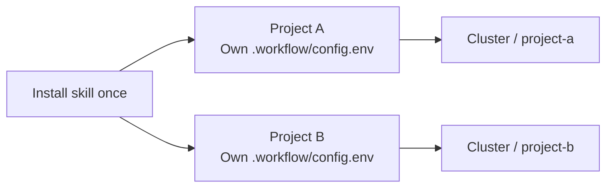

# NexusHPC

**Keep your code local. Run experiments on your cluster. Bind the workflow to each project.**

**English** | [简体中文](README.zh-CN.md)

NexusHPC is a Codex skill for research projects that use SSH, rsync, and OpenPBS/PBS Professional. Install the skill once, initialize each new project, and reuse that project's saved settings for code synchronization, PBS jobs, and result retrieval.

[Quick start](#quick-start) · [Configuration](#configuration) · [Commands](#commands) · [Troubleshooting](#troubleshooting)

## One installation, independent projects



Each project's `.workflow/config.env` stores its remote host, destination, environments, and job settings. Its sync exclusions and result list also live inside that project. The skill provides the template and instructions; project settings stay with the project.

- **Initialize once per project.** Existing files and configuration are preserved.
- **Reuse the binding.** Later requests such as “sync this project” read its saved configuration.
- **Keep a stable destination.** Initialization saves a valid `PROJECT_SLUG`; moving or renaming the local folder keeps that remote identifier.
- **Operate from the project.** The installed `scripts/remote-workflow` locates its own project by default, even when called from another directory. It can run without the original skill folder.

Creating a new project by copying an old one requires a new destination and a review of copied checkpoints and completion markers. Re-running `init` preserves the old configuration; it does not rebind or upgrade it.

## What it does

| Task | What you get |
| --- | --- |
| Initialize a project | Project configuration, sync/result lists, PBS scripts, and project instructions |
| Preview and sync code | SSH/rsync changes with per-file byte counts and exclusion rules |
| Submit experiments | PBS resource requests and an optional chain of continuation jobs |
| Inspect progress | Queue, logs, checkpoints, results, and completion-marker checks |
| Retrieve results | Only the project-relative paths listed in the result manifest |
| Prepare GitHub changes | An optional size/filename check and whitelist-based staging |

Choose the operation you need. Initializing a binding does not upload files, submit jobs, or start background synchronization.

## Requirements

| Location | Requirements |
| --- | --- |
| Local machine | macOS or Linux; Bash, SSH, rsync, and conda |
| Agent | Codex with access to local skills and shell commands |
| Remote cluster | Linux; Bash, rsync, conda, GNU `timeout`, and OpenPBS/PBS Professional |
| PBS resources | Support for `select=1:ngpus=...:ncpus=...:mem=...` and `afterany` dependencies |
| Training code | A real training entrypoint with checkpoint/resume and termination handling |

Use your existing SSH access and conda environments. The skill does not provision a cluster or create these automatically. Slurm and Torque are outside the bundled scheduler support. Confirm the resource syntax and queue limits with your cluster before submitting jobs.

The optional checkpoint helper uses PyTorch and NumPy. The CLI itself is a Bash script; those Python packages are needed only when using the helper.

## Quick start

### 1. Install the skill once

Clone this repository:

```bash
git clone https://github.com/LiweiDengDavid/NexusHPC.git
cd NexusHPC
```

From the directory containing `SKILL.md`, `bin/`, and `template/`, run:

```bash
(
  set -eu
  RW_SKILL_DIR="${CODEX_HOME:-$HOME/.codex}/skills/nexushpc"
  mkdir -p "$(dirname "$RW_SKILL_DIR")"
  mkdir "$RW_SKILL_DIR"
  cp -R SKILL.md agents bin template README.md README.zh-CN.md LICENSE "$RW_SKILL_DIR/"
)
```

This is a fresh-install command: it stops if the destination already exists. Keep the complete folder, including `template/.workflow/`. If the skill is not discovered immediately, start a new Codex session.

### 2. Initialize and bind a project

Open your research project in Codex and ask:

> Use $nexushpc to initialize and bind this project to my PBS cluster. Reuse any existing settings, ask for missing connection details, and configure the project without uploading or submitting anything yet.

Or initialize it directly. Replace the example path with an existing project directory:

```bash
RW_SKILL_DIR="${CODEX_HOME:-$HOME/.codex}/skills/nexushpc"
RW_PROJECT="/absolute/path/to/your/project"
bash "$RW_SKILL_DIR/bin/remote-workflow" init "$RW_PROJECT"
```

Edit the generated [configuration](template/.workflow/config.env) in your project's `.workflow/config.env`. Update the corresponding fields there; the following is an example, not a replacement for the full file:

```bash
PROJECT_SLUG="project-a"
REMOTE_HOST="research-cluster"
REMOTE_BASE_DIR="/home/YOUR_USERNAME/projects"
LOCAL_CONDA_ENV="research-cpu"
REMOTE_CONDA_ENV="research-gpu"
PBS_QUEUE="gpuq"
```

Replace the host, directory, environments, and queue with values from your system. The resulting binding is:

```text
local project directory ↔ REMOTE_HOST:REMOTE_BASE_DIR/PROJECT_SLUG
```

Verify the complete destination and avoid accidentally assigning two projects to the same remote directory. Review `.workflow/sync-exclude.txt` and `.workflow/important-results.txt`. If required values are missing, the project is initialized but its binding is still pending. A configured binding is separate from a verified remote connection.

Set `TRAIN_COMMAND` when you are ready to submit, using your actual resumable training entrypoint. It is not needed just to initialize, sync, or inspect a configured project.

### 3. Use the saved project binding

For later work, ask Codex for the operation you need:

> Preview this project's code synchronization. Show the destination, changed files, and any deletions.

> Submit this project's experiment after checking its resume behavior and PBS resources.

> Check whether this project's latest job completed. Use the logs, result files, and completion marker as evidence.

> Retrieve the results listed in this project's important-results file. Give me commands for files that exceed the Agent transfer limit.

You can also run project commands directly:

```bash
RW_PROJECT="/absolute/path/to/your/project"
bash "$RW_PROJECT/scripts/remote-workflow" doctor
bash "$RW_PROJECT/scripts/remote-workflow" sync --dry-run
```

These commands contact your configured cluster. A sync preview transfers no file contents. Review it before choosing to run `sync` without `--dry-run`.

For a new project B, repeat step 2 with B's directory. The installed skill is reused; B gets its own configuration, rules, and remote destination.

## Configuration

All values belong in the project's `.workflow/config.env`. It is executable shell configuration: inspect it before use, trust its source, and keep credentials out of it.

| Setting | Purpose / shipped value |
| --- | --- |
| `PROJECT_SLUG` | Saved project identifier; fill explicitly if the folder name cannot produce a valid one |
| `REMOTE_HOST`, `REMOTE_BASE_DIR` | SSH destination and absolute parent directory; no personal defaults |
| `LOCAL_CONDA_ENV`, `REMOTE_CONDA_ENV`, `PBS_QUEUE` | Existing environments and queue; initially empty |
| `TRAIN_COMMAND` | Your training command; initially empty, required for submission |
| `PBS_WALLTIME` | `01:00:00`, an example rather than a cluster limit |
| `PBS_NGPUS`, `PBS_NCPUS`, `PBS_MEM` | `1`, `4`, `64gb`; adjust to your experiment and queue |
| `SLICE_SECONDS`, `TERM_GRACE_SECONDS` | `3000`, `300`; their sum must be strictly below walltime |
| `MAX_CONTINUATIONS` | `8` follow-up jobs at most, in addition to the initial job |
| `QSUB_BIN`, `QSTAT_BIN`, `QDEL_BIN` | Optional executable paths; otherwise use the remote `PATH` |
| `CONDA_SH` | Optional trusted remote conda initialization script |
| `CHECKPOINT_FILE` | `outputs/checkpoints/resume_state.pt` |
| `DONE_FILE` | `outputs/status/TRAINING_COMPLETE` |
| `SYNC_DELETE` | `1`; removes remote extras outside excluded/protected paths |

No queue-wide six-hour limit is embedded in this edition. Use a walltime supported by your queue and leave enough time for checkpointing and cleanup.

## Commands

After initialization, run `bash /absolute/project/scripts/remote-workflow COMMAND`. An explicit project argument is optional for the project-installed script. Use the full skill's `bin/remote-workflow init PROJECT_ROOT` to initialize another project.

| Command | Effect | `--dry-run` |
| --- | --- | --- |
| `init PROJECT_ROOT` | Install missing project files; preserve existing ones | No |
| `doctor` | Check local tools/environment and remote tools/environment/queue | No |
| `sync` | Mirror code with the project's exclusions | Yes |
| `submit` | Sync again, then submit the initial PBS job | Yes |
| `status` | Read queue, artifact, and marker status | No |
| `pull` | Retrieve paths in `.workflow/important-results.txt` | Yes |
| `github-check` | Check candidate file sizes and sensitive-looking filenames | No |
| `github-stage` | Stage eligible files from `.workflow/github-include.txt` | No |

**`submit` performs its own sync.** Its transfer list and deletion effects need the same review as a standalone sync. GitHub commands do not create a repository, commit, or push.

## Resumption and completion

The bundled PBS scripts can queue an `afterany` continuation before training starts. At the configured slice deadline, GNU `timeout` sends `SIGTERM` and allows a grace period before forcing termination.

Your training program must integrate the actual recovery logic:

1. Automatically load an existing checkpoint and resume the next unfinished epoch or step.
2. Save atomically at least once per epoch and when responding to termination.
3. Include model, optimizer, scheduler/scaler where applicable, progress, random states, and necessary sampler/trainer state.
4. Write `DONE_FILE` only after all required training and result validation succeed.

[checkpoint.py](template/src/remote_workflow/checkpoint.py) supplies PyTorch save/load helpers and a stop flag. The training loop must use them; mid-epoch recovery remains the caller's responsibility. Other frameworks need equivalent recovery logic.

On completion or a fatal non-resumable exit, the script attempts to cancel the queued continuation with `qdel`. Cancellation is best-effort: verify the queue after a fatal failure, because a failed `qdel` can leave a continuation scheduled. A remaining continuation exits without training if `DONE_FILE` already exists. Timeout/termination exits may continue, so inspect recurring failures rather than assuming every retry will recover. The continuation count is finite.

A job disappearing from `qstat`, a zero exit status, or the existence of a checkpoint alone does not prove completion. Require the completion marker together with expected valid results and supporting logs.

For queued jobs or expected runtimes above five minutes, the skill hands off exact job IDs, paths, and queue/log/artifact commands instead of continuously polling. Training logs live in `outputs/logs/`; results live in `outputs/results/` or `outputs/reports/`.

## Transfer rules

Sync previews include the change indicator, file size in bytes, and path. Inspect all affected files and deletion entries before transferring. Default exclusions protect outputs, checkpoints, raw/external data, temporary files, Git metadata, and common secret filenames; inspect project-specific private files too.

- **Below 10 MiB per file:** the Agent may perform a requested transfer to a known destination and verify it.
- **At or above 10 MiB per file:** the Agent supplies an exact command for the user to run. Downloads should be resumable.
- **GitHub:** a separate 99 MiB guard checks candidate files. The Agent's 10 MiB transfer rule still applies.

The 10 MiB rule is a skill instruction, not a CLI-enforced file-size cap. The GitHub filename check is not a content-based secret scanner. `SYNC_DELETE=1` can delete remote files outside excluded paths, so review deletion previews before syncing.

## Troubleshooting

| Situation | What to check |
| --- | --- |
| Required configuration is missing | Complete this project's binding; do not change the shared skill template |
| The local folder has moved or changed name | Keep the saved `PROJECT_SLUG`; older empty slugs need the existing remote identifier saved explicitly |
| A copied project points to the old experiment | Choose its new slug/destination and inspect copied checkpoints and `DONE_FILE` |
| A preview fails because the remote directory is absent | Create only the intended remote project directory, then repeat the preview; a failed preview is not approval to sync |
| Conda works interactively but fails in PBS | Set `CONDA_SH` to the cluster's trusted conda initialization script |
| PBS commands are not found | Configure the executable paths or the remote non-interactive `PATH` |
| The queue rejects the job | Check queue policy, requested resources, and the supported PBS `select` syntax |
| The job vanished but no completion marker exists | Read logs and check failure/continuation state; treat completion as unverified |
| A large checkpoint cannot be retrieved by the Agent | Use the generated resumable transfer command, or retrieve only the needed smaller results |

## Repository layout and maintenance

```text
NexusHPC/
├── README.md             English documentation
├── README.zh-CN.md       Chinese documentation
├── LICENSE              MIT License
├── SKILL.md              Instructions loaded by Codex
├── agents/openai.yaml    Skill display metadata
├── bin/remote-workflow   CLI and project initializer
└── template/             Files installed into each project
    ├── .workflow/        Configuration, transfer lists, and PBS scripts
    ├── AGENTS.md         Project workflow rules
    └── src/remote_workflow/checkpoint.py
```

Offline validation has covered standalone initialization, preserving existing files, independent project bindings, directory moves, transfer previews, and mocked PBS success/failure continuations. This does not certify compatibility with every cluster; perform a small PBS smoke run in your environment before a costly experiment.

With PyTorch and NumPy installed, run `python -B tests/test_checkpoint.py` from this repository to check RNG restoration and checkpoint loading. This regression uses CPU execution and simulated device mapping; it does not run a CUDA job.

When reporting an issue or proposing a change, include the command, expected/actual behavior, relevant tool versions, and a small reproducer with private details removed. Keep changes focused on the supported workflow. Updating the installed skill does not update scripts already copied into projects; review and apply project updates deliberately.

## License

This project is licensed under the [MIT License](LICENSE).
