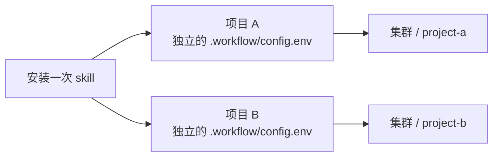

# NexusHPC

**在本地维护代码，在集群运行实验，为每个项目保存独立配置。**

[English](README.md) | **简体中文**

NexusHPC 是一个面向科研项目的 Codex skill，适用于使用 SSH、rsync 和 OpenPBS/PBS Professional 的工作流。安装一次 skill，为每个新项目初始化配置，之后便可复用该项目保存的设置，同步代码、运行 PBS 作业和回收结果。

## 安装一次，项目各自独立



每个项目的 `.workflow/config.env` 保存自己的远程主机、目标目录、运行环境和作业设置。同步排除规则和结果回收清单也保存在项目内。Skill 提供模板和操作指导，项目配置则随项目保存。

- **每个项目初始化一次。** 已有文件和配置会保留。
- **复用已有绑定。** 之后提出“同步这个项目”等请求时，会读取已保存的配置。
- **保持远程目标稳定。** 初始化时会保存有效的 `PROJECT_SLUG`；移动或重命名本地文件夹不会改变这个远程标识。
- **通过项目内的脚本操作。** 安装到项目中的 `scripts/remote-workflow` 默认定位自身所属的项目，即使从其他目录调用也一样；运行时无需依赖原始 skill 文件夹。

如果通过复制旧项目来创建新项目，需要为副本设置新的远程目标，并检查一同复制的检查点和完成标记。再次运行 `init` 会保留旧配置，不会重新绑定或升级项目。

## 功能

| 任务 | 提供的能力 |
| --- | --- |
| 初始化项目 | 生成项目配置、同步与结果清单、PBS 脚本和项目操作说明 |
| 预览并同步代码 | 通过 SSH/rsync 同步，显示每个文件的字节数，并应用排除规则 |
| 提交实验 | 设置 PBS 资源请求，并可串联后续续跑作业 |
| 查看进度 | 检查队列、日志、检查点、结果和完成标记 |
| 回收结果 | 仅回收结果清单中列出的项目相对路径 |
| 准备 GitHub 变更 | 可选的文件大小与文件名检查，以及按白名单暂存文件 |

按需选择操作。初始化项目绑定不会上传文件、提交作业或启动后台同步。

## 环境要求

| 位置 | 要求 |
| --- | --- |
| 本地计算机 | macOS 或 Linux；Bash、SSH、rsync 和 conda |
| Agent | 可访问本地 skills 并执行 shell 命令的 Codex |
| 远程集群 | Linux；Bash、rsync、conda、GNU `timeout` 和 OpenPBS/PBS Professional |
| PBS 资源 | 支持 `select=1:ngpus=...:ncpus=...:mem=...` 和 `afterany` 依赖 |
| 训练代码 | 有实际的训练入口，并实现检查点保存、恢复和终止信号处理 |

使用已有的 SSH 访问方式和 conda 环境。Skill 不会自动部署集群或创建这些环境。随包提供的调度脚本不支持 Slurm 和 Torque。提交作业前，请核对集群支持的资源语法和队列限制。

可选的检查点辅助模块使用 PyTorch 和 NumPy。CLI 本身是 Bash 脚本；只有使用该辅助模块时才需要这些 Python 包。

## 快速开始

### 1. 安装一次 skill

克隆本仓库：

```bash
git clone https://github.com/LiweiDengDavid/NexusHPC.git
cd NexusHPC
```

在包含 `SKILL.md`、`bin/` 和 `template/` 的目录中运行：

```bash
(
  set -eu
  RW_SKILL_DIR="${CODEX_HOME:-$HOME/.codex}/skills/nexushpc"
  mkdir -p "$(dirname "$RW_SKILL_DIR")"
  mkdir "$RW_SKILL_DIR"
  cp -R SKILL.md agents bin template references hpc-status README.md README.zh-CN.md LICENSE "$RW_SKILL_DIR/"
)
```

这是首次安装命令：如果目标目录已存在，命令会停止。请保留完整文件夹，包括 `template/.workflow/`。如果 Codex 没有立即识别到 skill，请开启新的 Codex 会话。

### 2. 初始化并绑定项目

在 Codex 中打开科研项目，然后提出请求：

> 使用 $nexushpc 初始化这个项目，并绑定到我的 PBS 集群。复用已有设置，向我询问缺少的连接信息；先完成项目配置，暂时不要上传文件或提交作业。

也可以直接初始化。将示例路径替换为已存在的项目目录：

```bash
RW_SKILL_DIR="${CODEX_HOME:-$HOME/.codex}/skills/nexushpc"
RW_PROJECT="/absolute/path/to/your/project"
bash "$RW_SKILL_DIR/bin/remote-workflow" init "$RW_PROJECT"
```

编辑项目中生成的 `.workflow/config.env`，其模板见[配置文件](template/.workflow/config.env)。修改其中对应的字段；以下仅为示例，不要用它替换完整文件：

```bash
PROJECT_SLUG="project-a"
REMOTE_HOST="research-cluster"
REMOTE_BASE_DIR="/home/YOUR_USERNAME/projects"
LOCAL_CONDA_ENV="research-cpu"
REMOTE_CONDA_ENV="research-gpu"
PBS_QUEUE="gpuq"
```

将主机、目录、环境和队列替换为自己系统中的值。最终绑定关系为：

```text
本地项目目录 ↔ REMOTE_HOST:REMOTE_BASE_DIR/PROJECT_SLUG
```

核对完整的远程目标，避免误将两个项目绑定到同一远程目录。检查 `.workflow/sync-exclude.txt` 和 `.workflow/important-results.txt`。如果缺少必填值，表示项目已初始化，但仍待完成绑定。保存好绑定配置，也不代表已验证远程连接可用。

准备提交作业时，再将 `TRAIN_COMMAND` 设置为实际支持断点续训的训练入口。仅初始化、同步或查看已配置项目时，不需要填写它。

### 3. 使用项目保存的绑定

后续工作中，直接向 Codex 提出所需操作：

> 预览这个项目的代码同步，显示目标位置、变更文件和将要删除的内容。

> 检查这个项目的断点续训能力和 PBS 资源设置后，提交实验。

> 检查这个项目最近的作业是否已完成，并以日志、结果文件和完成标记为依据。

> 回收这个项目 important-results 文件中列出的结果。超过 Agent 传输限制的文件，请给我可直接执行的命令。

也可以直接运行项目命令：

```bash
RW_PROJECT="/absolute/path/to/your/project"
bash "$RW_PROJECT/scripts/remote-workflow" doctor
bash "$RW_PROJECT/scripts/remote-workflow" sync --dry-run
```

这些命令会连接配置中的集群。同步预览不会传输文件内容。检查预览后，再决定是否运行不带 `--dry-run` 的 `sync`。

对于新项目 B，使用 B 的目录重复第 2 步即可。无需重新安装 skill；B 会有自己的配置、规则和远程目标。

## 配置

所有配置都保存在项目的 `.workflow/config.env` 中。这是可执行的 shell 配置：使用前应检查内容、确认来源可信，并且不要在其中保存凭据。

| 配置项 | 用途 / 随包提供的值 |
| --- | --- |
| `PROJECT_SLUG` | 保存的项目标识；如果无法从文件夹名称生成有效值，需要手动填写 |
| `REMOTE_HOST`, `REMOTE_BASE_DIR` | SSH 目标和绝对路径形式的父目录；不预设个人配置 |
| `LOCAL_CONDA_ENV`, `REMOTE_CONDA_ENV`, `PBS_QUEUE` | 已有运行环境和队列；初始为空 |
| `TRAIN_COMMAND` | 训练命令；初始为空，提交时必填 |
| `PBS_WALLTIME` | `01:00:00`，仅为示例，并非集群时间上限 |
| `PBS_NGPUS`, `PBS_NCPUS`, `PBS_MEM` | `1`、`4`、`64gb`；根据实验和队列调整 |
| `SLICE_SECONDS`, `TERM_GRACE_SECONDS` | `3000`、`300`；两者之和必须严格小于 walltime |
| `MAX_CONTINUATIONS` | 默认 `0`；全量训练需要多个时间片时，显式设置有限的后续作业数 |
| `QSUB_BIN`, `QSTAT_BIN`, `QDEL_BIN` | 可选的可执行文件路径；未设置时使用远程 `PATH` |
| `CONDA_SH` | 可选的、可信的远程 conda 初始化脚本 |
| `CHECKPOINT_FILE` | `outputs/checkpoints/resume_state.pt` |
| `DONE_FILE` | `outputs/status/TRAINING_COMPLETE` |
| `SYNC_DELETE` | `1`；删除远程目录中未被排除或保护的多余文件 |

本版本没有内置所有队列通用的六小时上限。请使用队列支持的 walltime，并为保存检查点和清理工作留出足够时间。

## 命令

初始化后，运行 `bash /absolute/project/scripts/remote-workflow COMMAND`。项目内的脚本可以省略显式项目参数。初始化其他项目时，使用完整 skill 中的 `bin/remote-workflow init PROJECT_ROOT`。

| 命令 | 作用 | 支持 `--dry-run` |
| --- | --- | --- |
| `init PROJECT_ROOT` | 安装缺少的项目文件，保留已有文件 | 否 |
| `doctor` | 检查本地工具和环境，以及远程工具、环境和队列 | 否 |
| `sync` | 根据项目排除规则镜像同步代码 | 是 |
| `submit` | 再次同步，然后提交初始 PBS 作业 | 是 |
| `status` | 读取队列、产物和标记状态 | 否 |
| `pull` | 回收 `.workflow/important-results.txt` 中的路径 | 是 |
| `github-check` | 检查候选文件的大小及疑似敏感文件名 | 否 |
| `github-stage` | 暂存 `.workflow/github-include.txt` 中符合条件的文件 | 否 |

**`submit` 会自行执行一次同步。** 其传输清单和删除操作需要与单独运行 `sync` 时一样仔细检查。GitHub 相关命令不会创建仓库、提交 commit 或推送。

## 同一个 PBS 作业完成 smoke 和全量

请求运行完整实验时，默认只提交一次初始 PBS 作业：先执行 smoke 并验证结果，通过后在同一次资源分配中立即运行全量任务，无需再次提交或申请批准。Smoke 或验证失败就退出；用户明确只要求 smoke 时，验证后停止。

将 `TRAIN_COMMAND` 指向项目入口脚本，例如 `bash scripts/run/smoke_then_full.sh`。按实际命令编写脚本：先 smoke、再验证产物，最后用 `exec` 启动支持恢复的全量入口；前两步任一步失败都立即退出。Smoke 的输出和检查点单独保存，不覆盖全量状态，也不写全量的 `DONE_FILE`。不要直接将 `smoke && full` 写入 `TRAIN_COMMAND`，因为 PBS 执行器会在该值前加上 `exec`。

按全量任务申请资源，时间预算覆盖两个阶段、验证及检查点清理宽限期。新项目默认 `MAX_CONTINUATIONS=0`，单时间片任务不会预排第二个作业。较长的全量训练显式启用有限的 `afterany` 续跑链，恢复同一个实验；只有代码和配置仍匹配时才跳过此前通过的 smoke。`init` 保留已有配置，提交前应检查原有续跑次数。如果要求总共只有一个作业，应先确认完整任务能在队列允许的一次资源分配中完成。

## 断点续训与完成判定

随包提供的 PBS 脚本可以在训练开始前，预先排入一个依赖 `afterany` 的续跑作业。到达配置的时间片截止时间时，GNU `timeout` 会发送 `SIGTERM`，等待宽限期结束后才强制终止。

训练程序需要自行接入实际的恢复逻辑：

1. 自动加载已有检查点，从下一个尚未完成的 epoch 或 step 继续。
2. 至少每个 epoch 原子保存一次，并在响应终止信号时保存。
3. 保存模型、优化器、适用时的 scheduler/scaler、训练进度、随机数状态，以及必要的 sampler/trainer 状态。
4. 仅在所有必要训练和结果验证成功后，写入 `DONE_FILE`。

[checkpoint.py](template/src/remote_workflow/checkpoint.py) 提供 PyTorch 保存/加载辅助函数和停止标志。训练循环需要实际使用这些工具；epoch 中途的恢复仍由调用方负责。其他框架需要实现等价的恢复逻辑。

完成训练或因致命且不可恢复的错误退出时，脚本会尝试通过 `qdel` 取消已排队的续跑作业。取消操作不保证成功：发生致命错误后应核对队列，因为 `qdel` 失败可能使续跑作业仍留在队列中。如果 `DONE_FILE` 已存在，残留的续跑作业会直接退出，不再训练。超时或终止退出可能触发续跑，因此遇到反复失败时应检查原因，不能假定重试一定能够恢复。续跑次数有上限。

作业从 `qstat` 消失、退出码为零，或者仅存在检查点，都不能单独证明实验已完成。应同时确认完成标记、符合预期且有效的结果，以及对应日志。

对于排队中的作业，或预计运行超过五分钟的作业，skill 会交接确切的作业 ID、路径以及队列、日志、产物检查命令，而不会持续轮询。训练日志位于 `outputs/logs/`；结果位于 `outputs/results/` 或 `outputs/reports/`。

## 传输规则

同步预览会显示变更标识、文件字节数和路径。传输前应检查所有受影响的文件和删除项。默认排除规则保护输出、检查点、原始/外部数据、临时文件、Git 元数据，以及常见的敏感文件名；还应检查项目中特有的私有文件。

- **单文件小于 10 MiB：** Agent 可以将请求范围内的文件传输到已知目标，并验证结果。
- **单文件达到或超过 10 MiB：** Agent 提供确切命令，由用户执行。下载应支持断点续传。
- **GitHub：** 独立的 99 MiB 检查规则会检查候选文件。Agent 的 10 MiB 传输规则仍然适用。

10 MiB 规则是 skill 对 Agent 的操作要求，不是 CLI 强制执行的文件大小上限。GitHub 文件名检查也不等于扫描文件内容中的秘密信息。`SYNC_DELETE=1` 可能删除排除路径之外的远程文件，因此同步前应检查删除预览。

## 常见问题

| 情况 | 检查方法 |
| --- | --- |
| 缺少必要配置 | 完成当前项目的绑定，不要修改共享 skill 模板 |
| 本地文件夹移动或改名 | 保留已保存的 `PROJECT_SLUG`；旧项目若仍为空，应明确填入已有远程标识 |
| 复制出的项目仍指向旧实验 | 选择新的 slug 和目标目录，并检查复制来的检查点和 `DONE_FILE` |
| 远程目录不存在，导致预览失败 | 仅创建预期的远程项目目录，然后重新预览；预览失败不代表可以直接同步 |
| 交互式终端中 conda 可用，但 PBS 中失败 | 将 `CONDA_SH` 设置为集群上可信的 conda 初始化脚本 |
| 找不到 PBS 命令 | 配置可执行文件路径，或远程非交互式 shell 的 `PATH` |
| 队列拒绝作业 | 检查队列规则、申请的资源以及支持的 PBS `select` 语法 |
| 作业消失，但没有完成标记 | 阅读日志并检查失败或续跑状态，将完成状态视为尚未验证 |
| Agent 无法回收较大的检查点 | 使用生成的断点续传命令，或仅回收所需的较小结果文件 |

## 仓库结构与维护

```text
NexusHPC/
├── README.md             英文文档
├── README.zh-CN.md       中文文档
├── LICENSE              MIT 许可证
├── SKILL.md              Codex 加载的指令
├── agents/openai.yaml    Skill 展示信息
├── bin/remote-workflow   CLI 和项目初始化工具
└── template/             安装到各项目中的文件
    ├── .workflow/        配置、传输清单和 PBS 脚本
    ├── AGENTS.md         项目工作流规则
    └── src/remote_workflow/checkpoint.py
```

离线验证已覆盖独立初始化、保留已有文件、独立项目绑定、目录移动、传输预览，以及通过模拟 PBS 验证成功/失败时的续跑行为。这不代表已验证对所有集群的兼容性；应在同一个 PBS 作业中先验证小规模 smoke，再进入昂贵的全量阶段。

安装 PyTorch 和 NumPy 后，可在本仓库目录运行 `python -B tests/test_checkpoint.py`，检查随机数状态恢复和检查点加载。该回归检查使用 CPU 和模拟的设备映射，不会运行 CUDA 作业。

报告问题或提出修改时，请附上执行命令、预期与实际行为、相关工具版本，以及去除私有信息的最小复现示例。修改应聚焦于已支持的工作流。更新已安装的 skill 不会自动更新此前复制到项目中的脚本；应检查变更后，有针对性地更新项目。

## 许可证

本项目采用 [MIT 许可证](LICENSE)。

## HPC status dashboard

现已包含 `hpc-status` 入口及项目模板。参见[安装与使用说明](references/hpc-status-usage.md)：任务登记、默认/详细/JSON 视图，以及首次查看完成后 24 小时自动隐藏。
